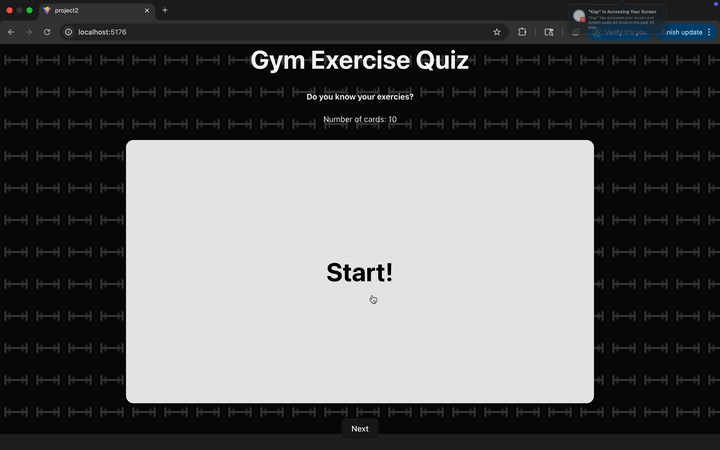

# Web Development Project 2 - *Gym Exercise Flashcards*

Submitted by: **Fareed Uddin**

This web app: **is an interactive flashcard quiz for learning gym exercises and their target muscles. Users can click on a card to flip it between the exercise name and the corresponding muscle group. The app displays a title, a short description, the total number of cards, and allows the user to move to a random next card. The design includes a flipping animation for the cards and a subtle dumbbell-pattern background.**

Time spent: **8** hours spent in total

## Required Features

The following **required** functionality is completed:

- [x] **The app displays the title of the card set, a short description, and the total number of cards**
  - [x] Title of card set is displayed 
  - [x] A short description of the card set is displayed 
  - [x] A list of card pairs is created
  - [x] The total number of cards in the set is displayed 
  - [x] Card set is represented as a list of card pairs (an array of dictionaries where each dictionary contains the question and answer is perfectly fine)
- [x] **A single card at a time is displayed**
  - [x] Only one half of the information pair is displayed at a time
- [x] **Clicking on the card flips the card over, showing the corresponding component of the information pair**
  - [x] Clicking on a card flips it over, showing the back with corresponding information 
  - [x] Clicking on a flipped card again flips it back, showing the front
- [x] **Clicking on the next button displays a random new card**

The following **optional** features are implemented:

- [ ] Cards contain images in addition to or in place of text
  - [ ] Some or all cards have images in place of or in addition to text
- [ ] Cards have different visual styles such as color based on their category
  - Example categories you can use:
    - Difficulty: Easy/medium/hard
    - Subject: Biology/Chemistry/Physics/Earth science

The following **additional** features are implemented:

* [x] Added a smooth 3D flipping animation for cards
* [x] Implemented a custom dumbbell SVG background pattern with a dark overlay to improve visual design!
* [x] Responsive design using CSS aspect-ratio so cards keep their shape on different screen sizes.

## Video Walkthrough

Here's a walkthrough of implemented required features:

GIF created with [Kap](https://getkap.co/) for macOS

## Notes

* Learning how to use useState effectively to manage both the current card index and flip state.
* Debugging random card generation to avoid picking invalid indices or repeating the same card.
* Figuring out the right CSS structure for the flip animation so that the entire card rotated, not just the text.
* Implementing a responsive background pattern and making sure it didn’t overwhelm the cards..

## License

    Copyright [2025] [Fareed Uddin]

    Licensed under the Apache License, Version 2.0 (the "License");
    you may not use this file except in compliance with the License.
    You may obtain a copy of the License at

        http://www.apache.org/licenses/LICENSE-2.0

    Unless required by applicable law or agreed to in writing, software
    distributed under the License is distributed on an "AS IS" BASIS,
    WITHOUT WARRANTIES OR CONDITIONS OF ANY KIND, either express or implied.
    See the License for the specific language governing permissions and
    limitations under the License.