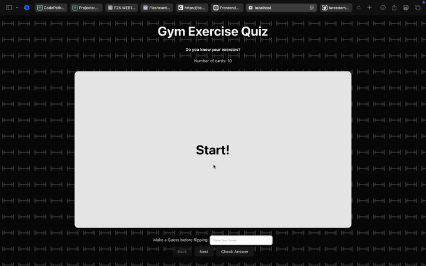

# Web Development Project 3 - *Gym Exercise Flashcards*

Submitted by: **Fareed Uddin**

This web app: **is an interactive flashcard quiz designed to help users learn and memorize common gym exercises and the muscle groups they target. Users can type their guesses before flipping the card, receive instant feedback on whether they are correct or not, and navigate through an ordered deck of exercise cards using Back and Next buttons. Each incorrect attempt triggers a short shake animation on the card to visually signal an error.**

Time spent: **10** hours spent in total

## Required Features

The following **required** functionality is completed:

- [x] **The user can enter their guess into an input box *before* seeing the flipside of the card**
  - Application features a clearly labeled input box with a submit button where users can type in a guess
  - Clicking on the submit button with an **incorrect** answer shows visual feedback that it is wrong 
  -  Clicking on the submit button with a **correct** answer shows visual feedback that it is correct
- [x] **The user can navigate through an ordered list of cardss**
  - A forward/next button displayed on the card navigates to the next card in a set sequence when clicked
  - A previous/back button displayed on the card returns to the previous card in the set sequence when clicked
  - Both the next and back buttons should have some visual indication that the user is at the beginning or end of the list (for example, graying out and no longer being available to click), not allowing for wrap-around navigation

The following **optional** features are implemented:

- [ ] Users can use a shuffle button to randomize the order of the cards
  - Cards should remain in the same sequence (**NOT** randomized) unless the shuffle button is clicked 
  - Cards should change to a random sequence once the shuffle button is clicked
- [ ] A user’s answer may be counted as correct even when it is slightly different from the target answer
  - Answers are considered correct even if they only partially match the answer on the card 
  - Examples: ignoring uppercase/lowercase discrepancies, ignoring punctuation discrepancies, matching only for a particular part of the answer rather than the whole answer
- [ ] A counter displays the user’s current and longest streak of correct responses
  - The current counter increments when a user guesses an answer correctly
  - The current counter resets to 0 when a user guesses an answer incorrectly
  - A separate counter tracks the longest streak, updating if the value of the current streak counter exceeds the value of the longest streak counter 
- [ ] A user can mark a card that they have mastered and have it removed from the pool of displayed cards
  - The user can mark a card to indicate that it has been mastered
  - Mastered cards are removed from the pool of displayed cards and added to a list of mastered cards

The following **additional** features are implemented:

* [x] Implemented a custom dumbbell SVG background pattern with a dark overlay to improve visual design
* [x] Responsive design using CSS aspect-ratio so cards keep their shape on different screen sizes.
* [x] Responsive design using CSS aspect-ratio so cards keep their shape on different screen sizes..

 

## Video Walkthrough

Here's a walkthrough of implemented user stories:

GIF created with [Kap](https://getkap.co/) for macOS

## Notes

Challenges Encountered: 
* Learning how to manage component state using useState:
	-	We practiced storing and updating multiple pieces of state, including currentIndex (to track which card is showing) and isFlipped (to control the card’s front/back display).
	-	The “Check Answer” feature specifically reinforced how each click updates the isCorrect flag to trigger feedback and animations.
* Understanding user input and form handling in React:
	-	Learned how to bind the text input’s value to a state variable (userInput) and handle updates with the onChange event.
	-	The “Check Answer” button and onKeyDown for the Enter key both demonstrated how React handles controlled components without reloading the page.
*	Ensuring state updates (flip, input, correctness) didn’t conflict with each other.
*	Debugging why the entire card wasn’t flipping—resolved by moving the 3D transform to the correct element.
*	Creating a visually clear but simple CSS design that works across different viewport sizes.
*	Implementing the shake animation without interfering with the existing flip animation.

## License

    Copyright [2025] [Fareed Uddin]

    Licensed under the Apache License, Version 2.0 (the "License");
    you may not use this file except in compliance with the License.
    You may obtain a copy of the License at

        http://www.apache.org/licenses/LICENSE-2.0

    Unless required by applicable law or agreed to in writing, software
    distributed under the License is distributed on an "AS IS" BASIS,
    WITHOUT WARRANTIES OR CONDITIONS OF ANY KIND, either express or implied.
    See the License for the specific language governing permissions and
    limitations under the License.